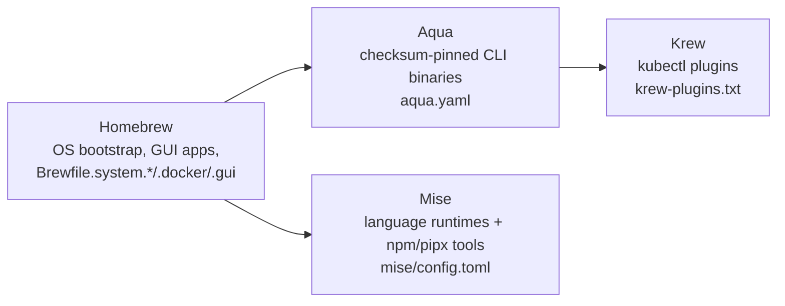

# CLAUDE.md

This file provides guidance to Claude Code (claude.ai/code) when working with code in this repository.

## Overview

Personal dotfiles managed by [Chezmoi](https://www.chezmoi.io/), targeting macOS and Linux. Chezmoi renders
templated files into `$HOME` and runs numbered scripts to install/configure tools. Three package managers, each
with one job:



**Why it's shaped this way, and what secrets/CI/Renovate do**: see [DESIGN.md](DESIGN.md).
**How to gain confidence in a change**: see [TESTING.md](TESTING.md).

## Repository layout

The tree is organized around *where things deploy to* and *what runs them*, not by tool. Use this to decide
where a new file belongs — leaf-level detail isn't enumerated here (that's what `ls`/`Glob` is for, and it would
go stale as scripts are added); this is the stable, abstract shape underneath everything else.

```text
.
├── private_dot_*/, private_Library/, dot_*   # actual tool configs, one dir per $HOME target, mirroring
│                                             # each tool's own on-disk layout (private_dot_config -> ~/.config,
│                                             # private_dot_local -> ~/.local, dot_bashrc -> ~/.bashrc, ...).
│                                             # new per-tool config goes here, never under .chezmoiscripts/
├── .chezmoiscripts/                          # the only place imperative setup logic lives (install/upgrade
│                                             # tools, generate what can't just be templated). Numeric prefix
│                                             # = execution order; run_before_* / run_after_* = before/after
│                                             # dotfiles are written; first-time vs. standard (see DESIGN.md)
│                                             # are separate files, not a branch in one script
├── .chezmoitemplates/                        # cross-cutting snippets (env vars, shared shell functions)
│                                             # included by >1 file in .chezmoiscripts/ — factor duplication
│                                             # between scripts here, not by copy-pasting between scripts
├── .first-time-setup/                        # seed config consumed once by the matching first-time script,
│                                             # then never read again. Not the live config — that's under
│                                             # private_dot_config/
└── root-level loose files                    # machine-wide inputs that aren't themselves deployed as
                                              # dotfiles (Brewfile.*, krew-plugins.txt, .chezmoi.toml.tmpl),
                                              # or apply to the repo itself rather than to $HOME (lint
                                              # configs, this doc set)
```

## Repo-specific constraints when editing templates

- Every `.tmpl` file must render successfully with `.chezmoi.os` forced to `"linux"` and every `bitwardenSecrets`
  call blanked — that's what CI actually checks (see [TESTING.md](TESTING.md)). Don't write template logic whose
  only valid path is `darwin` or depends on a real secret value being present.
- Env vars shared across multiple chezmoi scripts (`AQUA_ROOT_DIR`, `MISE_DATA_DIR`, `HOMEBREW_PREFIX`, etc.) live
  once in `.chezmoitemplates/*.env` and get pulled in per-script — add new shared vars there rather than
  redefining them in an individual script.

## Common commands

```bash
# Apply/re-apply the dotfiles from this source repo
chezmoi apply --source .

# Pull latest from git and apply in one step (day-to-day usage)
chezmoi update

# Preview what would change on this machine, without writing anything
chezmoi diff --source .

# Render a single templated file/script to inspect the output (what CI does before linting)
chezmoi execute-template --source=. < path/to/file.tmpl

# Repo linters
pre-commit run --all-files
shellcheck --rcfile .shellcheckrc <script>
yamllint --strict <file>.yaml
markdownlint-cli2 --fix --config .markdownlint-cli2.yaml <file>.md
dotenv-linter --skip QuoteCharacter <file>
```

## Secrets

Every credential is pulled via the `bitwardenSecrets` template function keyed by a fixed secret UUID, resolved
only at `chezmoi apply` time — never hardcoded. See [DESIGN.md](DESIGN.md#secrets-bitwarden-secrets-manager-not-plaintext)
for why. In practice: `private_dot_env.secrets.tmpl` (API keys, cloud creds, Terraform vars) and
`.chezmoiscripts/run_after_61_kubeconfig.sh.tmpl` (OIDC client credentials) are the two places new secret
references get added.

## Renovate

`.github/renovate.json` extends shared presets (`ppat/renovate-presets`, `aquaproj/aqua-renovate-config`) plus a
custom regex manager for versions pinned in YAML/`.env` comments:

```yaml
# renovate: datasource=github-releases depName=owner/repo
SOME_VERSION: "v1.2.3"
```

Use this pattern for any new tool version embedded directly in workflow YAML (see `CHEZMOI_VERSION` in
`lint.yaml`). Aqua/Mise-managed tool versions are bumped directly in `aqua.yaml`/`mise/config.toml` instead — do
not add a `# renovate:` comment for those, Renovate already tracks them natively.

## Commit style

Conventional Commits with a scope, e.g. `fix(cli-tools): update npm:@anthropic-ai/claude-code (2.1.210 ->
2.1.214)`. Scope names generally match the renovate customManager/preset group the change came from (e.g.
`cli-tools`, `dev-tools`, `lang-sdk`).
