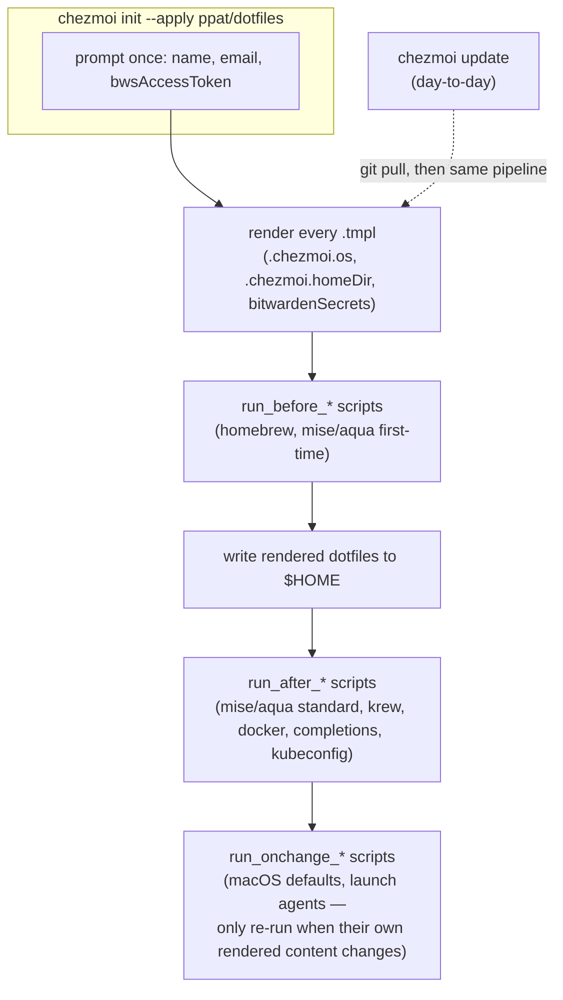
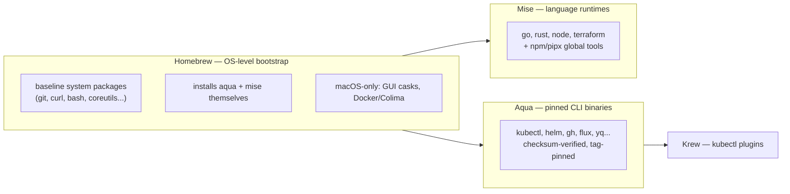
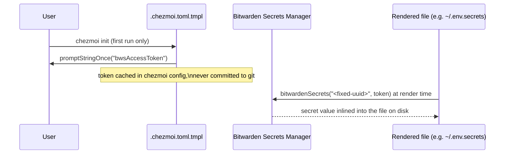

# DESIGN.md

Intent, trade-offs, and system structure behind this dotfiles repo. For "what do I run" / "how are files named",
see [CLAUDE.md](CLAUDE.md); for "how do I know a change is safe", see [TESTING.md](TESTING.md).

## Problem being solved

Personal environment configuration across multiple machines (a macOS laptop, Linux dev boxes, homelab nodes) that
must be:

- reproducible from zero on a fresh machine,
- safe to re-run repeatedly without re-prompting or clobbering machine-specific state,
- free of plaintext secrets in git history,
- cheap to keep current — dependency bumps shouldn't be hand-maintained toil.

## System overview

Chezmoi is the only orchestrator. It isn't a script that happens to call package managers — it *is* the thing
that decides what runs, in what order, against what rendered template context. Everything downstream (Homebrew,
Aqua, Mise, Krew) is invoked *by* chezmoi scripts, never the reverse.

## Why three package managers, not one

Each tool is used for what it's actually best at, not for uniformity:

- **Homebrew** is the only one of the three that can install itself on a bare OS and that ships macOS GUI apps
  (casks) — so it's the bootstrap layer, and it stays responsible for anything Aqua/Mise can't do (GUI apps,
  Colima/Docker on macOS, baseline OS packages like `coreutils`/`gnupg`).
- **Aqua** enforces checksums (`checksum.require_checksum: true` in `aqua.yaml`) on every install — every CLI
  binary version is pinned to an exact tag and its release-artifact hash is verified before use. That matters for
  security-relevant tools (`kubectl`, `helm`, `gh`, cloud CLIs) where supply-chain integrity is the point;
  Homebrew formulas and Mise's registry don't give the same per-artifact verification.
- **Mise** owns language runtimes and per-project version switching (`go`, `rust`, `node`, `terraform`), plus a
  handful of npm/pipx-distributed tools (Claude Code, markdownlint-cli2, ansible-core) that don't have Aqua
  registry entries. Mise's `[[env]]` file-loading in `private_dot_config/mise/config.toml` is also how this repo
  gets environment variables into every shell — no chezmoi script is needed for that.

Trade-off accepted: three tools means three update mechanisms and three places dependency drift can hide. This is
mitigated by giving each tool exactly one job — no package is ever installable through more than one of them —
and by automating all three through Renovate (below) instead of relying on manual upgrades.

## First-time vs. standard setup

Chezmoi scripts split into `run_before_NN_*` (before dotfiles are written) and `run_after_NN_*` (after). Within
that, the Aqua and Mise scripts each fork into a `First-Time` path and a `Standard` path (see
`.chezmoitemplates/script_aqua.sh` / `script_mise.sh`):

- **First-time**: destructive — wipes and reinitializes the tool's global config directory from
  `.first-time-setup/`, then does a fresh install. Runs once, guarded by a sentinel file
  (`.first-time-setup-complete`) so it never repeats.
- **Standard**: idempotent maintenance — upgrades installed packages, then prunes/vacuums anything unused. Safe
  to run on every `chezmoi update`.

This split exists because a fresh machine and a years-old machine need different things: a fresh machine needs
its config directory seeded from a known-good state, not whatever partial state a previous half-run left behind,
while an established machine must never have its config directory wiped just because `chezmoi update` ran again.

## Secrets: Bitwarden Secrets Manager, not plaintext

Every credential (Anthropic/OpenRouter API keys, cloud creds, Terraform variables, Kubernetes OIDC client
secrets) is fetched by a fixed secret UUID through the `bitwardenSecrets` template function, resolved only at
`chezmoi apply` time on the target machine. The repo therefore contains *which* secrets exist and their UUIDs,
but never a value. That trade-off is deliberate: a leaked UUID list is far less damaging than a leaked value, and
the UUIDs are useless without a valid `bwsAccessToken`.

It's also why environment config is split across two files instead of one: `private_dot_env.tmpl` holds config
that's fine to always load (colors, XDG paths, package-manager env), while `private_dot_env.secrets.tmpl` is
loaded only opportunistically (its `[[env]]` entry is commented out by default in
`private_dot_config/mise/config.toml`) so secrets aren't pulled into every shell session unless actually needed.

## CI can't be the full story

The lint pipeline (see [TESTING.md](TESTING.md)) renders every template with `.chezmoi.os` forced to `"linux"`
and every `bitwardenSecrets` call blanked out before linting. That's a deliberate, narrow goal: catch template
syntax errors and lint the *shape* of rendered output, not validate macOS-only code paths or real secret
substitution. Those two things can only be proven by `chezmoi apply` on a real machine with a real
`bwsAccessToken`, which is inherently outside what a shared CI runner can do. CI is a syntax/lint safety net, not
an end-to-end guarantee.

## Shared CI logic lives in a sibling repo

`.github/workflows/lint.yaml` delegates most of its jobs (Markdown, YAML, shellcheck, GitHub Actions, Renovate
config, pre-commit) to reusable workflows in `ppat/github-workflows`, pinned by commit SHA. Only the
chezmoi-specific rendering step is inlined, because it's the one piece of logic unique to how *this* repo's
templates work. Everything generic is shared and versioned once across this user's repos, and Renovate keeps the
pinned SHA current — the same automation-over-manual-toil principle applied to CI as to package versions.

## Renovate: one custom manager for template-pinned versions

Aqua and Mise track their own tool versions natively (`aqua.yaml`, `mise/config.toml`), so Renovate's built-in
managers handle those directly. But tool versions embedded as plain strings inside YAML/`.env` files (e.g.
`CHEZMOI_VERSION` in `lint.yaml`) aren't a format Renovate understands out of the box. The custom regex manager
in `.github/renovate.json` closes that narrow gap by keying off a `# renovate: datasource=... depName=...`
comment convention — one mechanism, used only where the native managers don't reach.
