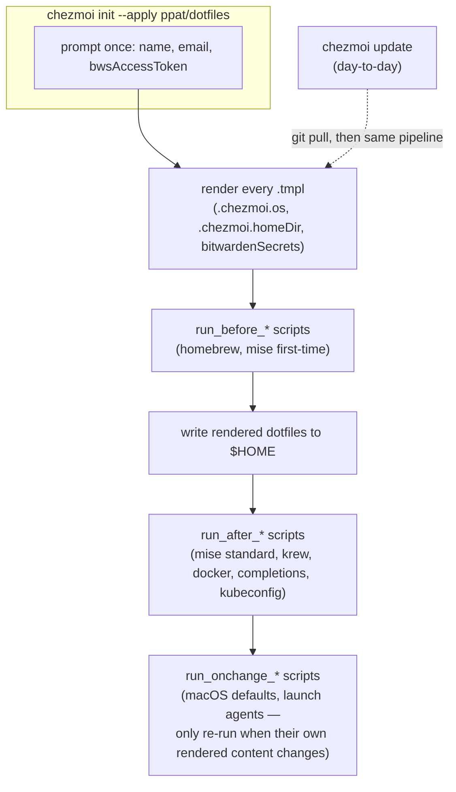
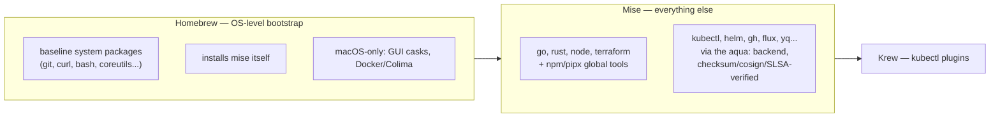
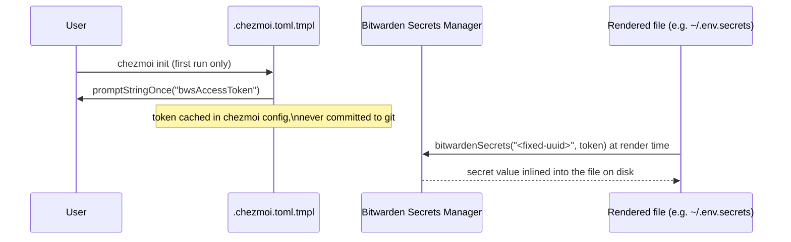

# DESIGN.md

Intent, trade-offs, and system structure behind this dotfiles repo. For "what do I run" / "how are files named",
see [CLAUDE.md](CLAUDE.md); for "how do I know a change is safe", see [TESTING.md](TESTING.md).

## Problem being solved

Personal environment configuration across multiple machines (a macOS laptop, Linux dev boxes, homelab nodes) that
must be:

- reproducible from zero on a fresh machine,
- safe to re-run repeatedly without re-prompting or clobbering machine-specific state,
- free of plaintext secrets in git history,
- cheap to keep current — dependency bumps shouldn't be hand-maintained toil.

## System overview

```mermaid
flowchart TD
    subgraph Bootstrap["chezmoi init --apply ppat/dotfiles"]
        Prompt["prompt once: name, email, bwsAccessToken"]
    end
    Prompt --> Render["render every .tmpl\n(.chezmoi.os, .chezmoi.homeDir, bitwardenSecrets)"]
    Render --> Before["run_before_* scripts\n(homebrew, mise first-time)"]
    Before --> Write["write rendered dotfiles to $HOME"]
    Write --> After["run_after_* scripts\n(mise standard, krew, docker, completions, kubeconfig)"]
    After --> OnChange["run_onchange_* scripts\n(macOS defaults, launch agents —\nonly re-run when their own rendered content changes)"]

    Update["chezmoi update\n(day-to-day)"] -.->|git pull, then same pipeline| Render
```

Chezmoi is the only orchestrator. It isn't a script that happens to call package managers — it *is* the thing
that decides what runs, in what order, against what rendered template context. Everything downstream (Homebrew,
Mise, Krew) is invoked *by* chezmoi scripts, never the reverse.

## Why two package managers, not one

```mermaid
flowchart LR
    subgraph Homebrew["Homebrew — OS-level bootstrap"]
        H1["baseline system packages\n(git, curl, bash, coreutils...)"]
        H2["installs mise itself"]
        H3["macOS-only: GUI casks, Docker/Colima"]
    end
    subgraph Mise["Mise — everything else"]
        M1["go, rust, node, terraform\n+ npm/pipx global tools"]
        M2["kubectl, helm, gh, flux, yq...\nvia the aqua: backend,\nchecksum/cosign/SLSA-verified"]
    end
    Homebrew --> Mise
    Mise --> Krew["Krew — kubectl plugins"]
```

Each tool is used for what it's actually best at, not for uniformity:

- **Homebrew** is the only one of the two that can install itself on a bare OS and that ships macOS GUI apps
  (casks) — so it's the bootstrap layer, and it stays responsible for anything Mise can't do (GUI apps,
  Colima/Docker on macOS, baseline OS packages like `coreutils`/`gnupg`).
- **Mise** owns everything else: language runtimes and per-project version switching (`go`, `rust`, `node`,
  `terraform`), npm/pipx-distributed tools (Claude Code, markdownlint-cli2, ansible-core), and pinned CLI
  binaries (`kubectl`, `helm`, `gh`, cloud CLIs) via its `aqua:` backend. That backend independently verifies
  cosign signatures, SLSA provenance, and GitHub artifact attestations by default, and every install is
  checksum-pinned per platform in a checked-in `mise.lock` (`[settings] lockfile = true` in
  `private_dot_config/mise/config.toml`) — the same per-artifact supply-chain guarantee a separate Aqua
  installation used to provide, now covered by one tool instead of two. Mise's `[[env]]` file-loading in
  `private_dot_config/mise/config.toml` is also how this repo gets environment variables into every shell — no
  chezmoi script is needed for that.

Historical note: this repo used to run Aqua alongside Mise specifically because Mise's `aqua` backend couldn't
maintain a lockfile at the time, so it couldn't give the same checksum guarantee Aqua's own
`checksum.require_checksum` did. Mise's lockfile support closed that gap, so the two-package-manager split
above reflects the current (not original) architecture — see git history for the migration.

## Mise tasks and `conf.d` overlays (PoC #747)

Phase 1 of the mise-bootstrap migration (ticket #747) evaluated two mise mechanisms beyond a plain `[tools]`
table: `conf.d` overlays (adopted — layout below) and mise's *task* runner as a place to move chezmoi script
bodies (evaluated, **not adopted**). The full investigation — every script scored against the criteria, every
falsification step, and the task files themselves (including the one that would have qualified) — is preserved
verbatim in a public gist rather than in this tree: <https://gist.github.com/ppat/ecca96047e599a58b121d513ec2c0b7e>.
This section keeps only the findings that outlive that verdict.

**Why mise tasks were evaluated and not adopted.** Of this repo's twelve `run_after_*`/`run_onchange_*` chezmoi
scripts, exactly one (`dotfiles:completions`, generating shell completions) qualified as a mise task: it is a
pure function that owns 100% of its own outputs. The other eleven were disqualified by one of two mechanisms
this PoC surfaced:

- `sources=`/`outputs=` staleness checking is pure-mtime, argument-blind, and has no success gate. That kills
  any query-then-mutate script (krew, the mise-standard upgrade, etc.) whose "outputs" are also written or
  deleted by the tool it wraps, outside the task's control — a receipt deleted out-of-band or a mid-run failure
  gets cached as a permanent false "up-to-date, skipping".
- chezmoi's `run_onchange_` hashes the *rendered wrapper script*, not anything it transitively calls. A wrapper
  whose only job is `mise run dotfiles:something` has bytes that never change, so editing the task body alone
  leaves the wrapper's hash untouched and chezmoi silently never re-runs it — exit 0, nothing logged, the work
  silently never happens. A hash-embedding fix (baking a hash of the task's rendered content into the wrapper)
  was built and confirmed to work, but was **not adopted**: it's a second, easy-to-forget coupling between a
  script and a task file, for logic that doesn't gain anything from being a task in the first place.

The remaining scripts are excluded by lifecycle position (they run before dotfiles exist, or are one-time
decommissioning, etc.) — a constraint mise's task runner has no lever for, independent of `sources`/`outputs`.

The owner's call: one task is worse than none. A pattern used exactly once isn't a pattern — it's an exception
with infrastructure attached: a second mental model for the same job, a `tasks/` directory, CI lint wiring that
existed *solely* to cover it, and a standing invitation for a future reader to "helpfully" add the
deliberately-omitted `sources=`/`outputs=` to `dotfiles:completions` and reintroduce the exact false-success
failure mode described above. `private_dot_config/mise/tasks/` and `poc/` have been removed accordingly; nothing
below this point describes a mechanism that still exists in this tree.

**`conf.d` overlay layout.** `private_dot_config/mise/conf.d/{linux,darwin}.toml` hold per-OS `[tools]`/
`[bootstrap.packages]` entries; the ~50 common entries stay in `private_dot_config/mise/config.toml` itself.
`.chezmoiignore` excludes whichever overlay doesn't match `.chezmoi.os`, using `ne` (exclude) rather than `eq`
(keep) so an untargeted OS drops both overlays instead of guessing. This isn't cosmetic: a wrong-OS overlay is a
hard `mise` error on this mise version (e.g. `brew-cask:` entries fail outright on Linux;
`mise bootstrap plan --detailed-exitcode` returns 1 instead of 0/2), not a harmless no-op.

**A `[tools]` entry needs a matching `mise.lock` entry, or the apply never converges.** Adding
`"aqua:containerd/nerdctl" = "2.3.5"` to `conf.d/linux.toml` without regenerating
`private_dot_config/mise/mise.lock` (an actual gap in this PoC, caught in a real pod, not a hypothetical) does
not fail loudly — it fails by never settling. `run_after_20_mise-standard.sh.tmpl` copies the committed
lockfile onto the machine and only then runs `mise upgrade --yes`; `mise upgrade` happily adds the missing
tool's entries to that *live* copy, but nothing ever writes them back into the repo. The next apply overwrites
the live lockfile with the (still-incomplete) committed one, `mise upgrade` re-adds the same entries, and the
cycle repeats forever. Two concrete costs, not just tidiness: (1) it never converges — the live lockfile
permanently differs from source-of-truth on every single apply; (2) until the entry exists in the lockfile, that
tool installs **unverified** — `[settings] lockfile = true` and the checked-in lockfile are this repo's
supply-chain guarantee (see above), and a `[tools]` entry with no lock entry is a hole in that guarantee, not a
cosmetic omission. Fix: `mise lock "<tool>"` (the exact `[tools]` key, e.g.
`aqua:containerd/nerdctl`), not a bare `mise lock` — the latter re-resolves and rewrites every existing entry,
turning a one-tool addition into an unreviewable diff across the whole file. Verify the diff is purely additive
before committing.

This generalizes past Linux: `mise lock` gates on the *invoking host's* OS against the aqua package's own
`supported_envs`, not on the target platform being locked. `conf.d/darwin.toml`'s `mas = "7.0.0"`
(`aqua:mas-cli/mas`) has the identical defect right now — no lockfile entry — and it cannot be closed from a
Linux machine at all: `mise lock mas` was tried from Linux with an explicit `--platform macos-arm64,macos-x64`
and even with `MISE_OS` overridden, and silently no-opped every time (confirmed against aqua-registry's
`pkgs/mas-cli/mas/registry.yaml`, whose current version entry is `supported_envs: [darwin]` — a categorical
host restriction, not a missing flag). Contrast with `nerdctl`'s `supported_envs: [linux, windows]`: the same
Linux host locked `windows-x64` entries for it without complaint, proving the limitation isn't "can't target a
platform other than the host's" in general — only "can't target a platform the package excludes the *host*
from". Practical effect: **a real macOS apply of this branch has the same non-convergence bug today**, unnoticed
because `full-apply-test` (`.github/workflows/full-apply-test.yaml`) only runs `ubuntu-24.04` — there is no
macOS CI leg to catch it. Closing it requires running `mise lock mas` on an actual Mac and committing the
result; phase 2 (chezmoi/bws/mise/mas as real `[tools]` entries) and the phase 4 bulk migration should budget
for a macOS run before merging, not assume a Linux box can produce the whole lockfile.

**This is a mechanism gap, not just a documentation one.** A rule that has to be remembered ("run `mise lock`
after editing `[tools]`") will be forgotten exactly like this one was. The cheap, non-built version: a CI check
that parses every `[tools]` key out of `config.toml` and both `conf.d/*.toml` files and asserts each has a
corresponding `[[tools."<key>"]]` table in `mise.lock` (a `yq`/`tomlq` diff, no new dependency) — failing PR CI
the same way `full-apply-test` already does, before a gap like this reaches a real pod. It can only check the
overlay whose OS matches the runner (Linux CI can't validate `darwin.toml`'s coverage), so it wouldn't have
caught the `mas` gap above without a macOS runner either — but it would have caught `nerdctl` on day one
instead of in a live pod. Rough cost: a short script plus one new CI step, well under an hour; not built here
because the task at hand was closing the specific gap, not standing up new CI — left as a follow-up.

**The absolute-path rule, and what it actually gates.** The symptom PoC started from was "`sources=`/`outputs=`
need absolute paths" — mise does not expand `~` in either field: a tilde path re-runs on every apply with a
silent warning instead of caching, while a `{{ .chezmoi.homeDir }}`-rendered absolute path caches correctly
(`sources up-to-date, skipping`). But the mechanism-level rule underneath that symptom is narrower and matters
more, and it's the one that produced the 1-of-12 result above: **`sources=`/`outputs=` may only be used where a
task's outputs are the complete, exclusive product of the task itself.** The shell-completions logic satisfies
this — it owns all seven completion files it writes, so "have the sources changed since the outputs were last
written" is a sound staleness question. Krew's logic does not: its "outputs" are krew's own receipt files, state
also written and deleted by `kubectl krew` itself outside any wrapper's control. Declaring
`outputs=["$KREW_ROOT/receipts/*.yaml"]` there (tried during the PoC) made the cache *lie* — delete one receipt
out-of-band and it reports "up-to-date, skipping" forever; fail mid-install and the partial receipt set is
cached as a permanent false success. This is a property of what the logic reconciles against, not of
tilde-vs-absolute paths or of tasks specifically, and it doesn't go away with more careful glob-writing — it's
why krew (and the other three query-then-mutate scripts) stay plain chezmoi scripts.

**The data-file convention.** Any data a script or task needs to iterate at run time (krew's plugin list today;
the Brewfiles in a later phase) should be a *deployed* file, referenced by a render-time-baked absolute path
(`{{ .chezmoi.homeDir }}/...`), not a source-tree path resolved at run time — `{{ .chezmoi.sourceDir }}` isn't
guaranteed to exist or be current once anything runs outside a live `chezmoi apply`. This is why
`krew-plugins.txt` lives at `~/.local/share/dotfiles/krew-plugins.txt` rather than under `~/.config/mise/data/`
(a location that only ever made sense if `dotfiles:krew` were a mise task, which the finding above rules out):
`~/.local/share/dotfiles/` is this repo's own data, depending on nothing else's directory conventions. Phase 4
should put the Brewfiles in the same place for the same reason.

**Secrets channel: `#MISE env=`, never `#USAGE`.** This finding is preserved because it's relevant if mise tasks
are ever revisited, even though no task currently reads it. Config-level `redactions` (in
`private_dot_config/mise/config.toml`) only masks values that reach a task through a `#MISE env={NAME="..."}`
directive. It does **not** mask a `#USAGE`-flag-derived `usage_*` value, default or CLI-supplied, on mise
2026.8.3 — confirmed with a positive and a negative control in the same rig (exact commands and the task file
that carried them: see the gist linked above). Root cause: `redactions` resolves names against the env map
built *before* `#USAGE` values are merged in, so naming a `usage_*` var in `redactions` never actually looks it
up. There is no alternate `#USAGE` sensitivity flag or per-task syntax that covers this on the current version.
Two corollaries worth keeping in mind if a real `bitwardenSecrets` value is ever routed into a task: matching is
exact-case-sensitive (a `redactions` entry that doesn't case-match its `env=` var name silently fails to mask,
indistinguishable at a glance from naming the wrong channel), and mise's own debug log is not a safe fallback
check — task stdout is never mirrored into it either way (so "0 occurrences in the log" proves nothing about
stdout), and when file-level debug logging *is* genuinely enabled (`MISE_LOG_LEVEL=debug`, not just
`MISE_LOG_FILE_LEVEL=debug`, which alone is a silent no-op), a CLI-supplied value leaks into that log **twice**
— via the `DEBUG ARGS:` line and the unredacted command-echo line — regardless of which channel carried it in.
Net rule, if this is ever revisited: `#USAGE` stays for ordinary, non-secret parameters; anything secret goes
through `#MISE env=`.

## First-time vs. standard setup

Chezmoi scripts split into `run_before_NN_*` (before dotfiles are written) and `run_after_NN_*` (after). Within
that, the Mise scripts fork into a `First-Time` path and a `Standard` path (see
`.chezmoitemplates/script_mise.sh`):

- **First-time**: destructive — wipes and reinitializes the tool's global config directory from
  `.first-time-setup/`, then does a fresh install. Runs once, guarded by a sentinel file
  (`.first-time-setup-complete`) so it never repeats.
- **Standard**: idempotent maintenance — upgrades installed packages, then prunes/vacuums anything unused. Safe
  to run on every `chezmoi update`.

This split exists because a fresh machine and a years-old machine need different things: a fresh machine needs
its config directory seeded from a known-good state, not whatever partial state a previous half-run left behind,
while an established machine must never have its config directory wiped just because `chezmoi update` ran again.

## Secrets: Bitwarden Secrets Manager, not plaintext

```mermaid
sequenceDiagram
    participant User
    participant ChezmoiToml as .chezmoi.toml.tmpl
    participant BWS as Bitwarden Secrets Manager
    participant Rendered as Rendered file (e.g. ~/.env.secrets)

    User->>ChezmoiToml: chezmoi init (first run only)
    ChezmoiToml->>User: promptStringOnce("bwsAccessToken")
    Note over ChezmoiToml: token cached in chezmoi config,\nnever committed to git
    Rendered->>BWS: bitwardenSecrets("<fixed-uuid>", token) at render time
    BWS-->>Rendered: secret value inlined into the file on disk
```

Every credential (Anthropic/OpenRouter API keys, cloud creds, Terraform variables, Kubernetes OIDC client
secrets) is fetched by a fixed secret UUID through the `bitwardenSecrets` template function, resolved only at
`chezmoi apply` time on the target machine. The repo therefore contains *which* secrets exist and their UUIDs,
but never a value. That trade-off is deliberate: a leaked UUID list is far less damaging than a leaked value, and
the UUIDs are useless without a valid `bwsAccessToken`.

It's also why environment config is split across two files instead of one: `private_dot_env.tmpl` holds config
that's fine to always load (colors, XDG paths, package-manager env), while `private_dot_env.secrets.tmpl` is
loaded only opportunistically (its `[[env]]` entry is commented out by default in
`private_dot_config/mise/config.toml`) so secrets aren't pulled into every shell session unless actually needed.

## CI can't be the full story

The lint pipeline (see [TESTING.md](TESTING.md)) renders every template with `.chezmoi.os` forced to `"linux"`
and every `bitwardenSecrets` call blanked out before linting. That's a deliberate, narrow goal: catch template
syntax errors and lint the *shape* of rendered output, not validate macOS-only code paths or real secret
substitution. Those two things can only be proven by `chezmoi apply` on a real machine with a real
`bwsAccessToken`, which is inherently outside what a shared CI runner can do. CI is a syntax/lint safety net, not
an end-to-end guarantee.

## Shared CI logic lives in a sibling repo

`.github/workflows/lint.yaml` delegates most of its jobs (Markdown, YAML, shellcheck, GitHub Actions, Renovate
config, pre-commit) to reusable workflows in `ppat/github-workflows`, pinned by commit SHA. Only the
chezmoi-specific rendering step is inlined, because it's the one piece of logic unique to how *this* repo's
templates work. Everything generic is shared and versioned once across this user's repos, and Renovate keeps the
pinned SHA current — the same automation-over-manual-toil principle applied to CI as to package versions.

## Renovate: one custom manager for template-pinned versions

Mise tracks its own tool versions natively (`mise/config.toml`), so Renovate's built-in `mise` manager handles
version bumps directly — including the `aqua:owner/repo`-backed entries — and also understands `mise.lock`
directly: it extracts each dependency's `lockedVersion` from the lockfile, and `lockFileMaintenance` (already
enabled repo-wide by the `ppat/renovate-presets:dev-tools` preset this repo extends — no extra config needed
here) periodically runs `mise lock --bump` to refresh it. That lockfile refresh is gated behind Renovate's
"unsafe execution" trust model, though, since running `mise lock` can execute repository-defined behavior: it
only actually runs once `mise` is added to the `allowedUnsafeExecutions` setting. That's a *self-hosted global*
Renovate setting (`RENOVATE_ALLOWED_UNSAFE_EXECUTIONS` env var / `--allowed-unsafe-executions` CLI flag /
admin config file — never something a repo's own `renovate.json` can set), and this org's Renovate runs
self-hosted via GitHub Actions (`ppat/github-workflows`'s `renovate.yaml`, which drives
`renovatebot/github-action` through env vars) — so the fix lives there
(`RENOVATE_ALLOWED_UNSAFE_EXECUTIONS: '["mise"]'` in that workflow's `env:` block), not in this repo. Tool
versions embedded as plain strings inside YAML/`.env` files (e.g. `CHEZMOI_VERSION` in `lint.yaml`) aren't a
format Renovate understands out of the box. The custom regex manager in `.github/renovate.json` closes that
narrow gap by keying off a `# renovate: datasource=... depName=...` comment convention — one mechanism, used
only where the native managers don't reach.
