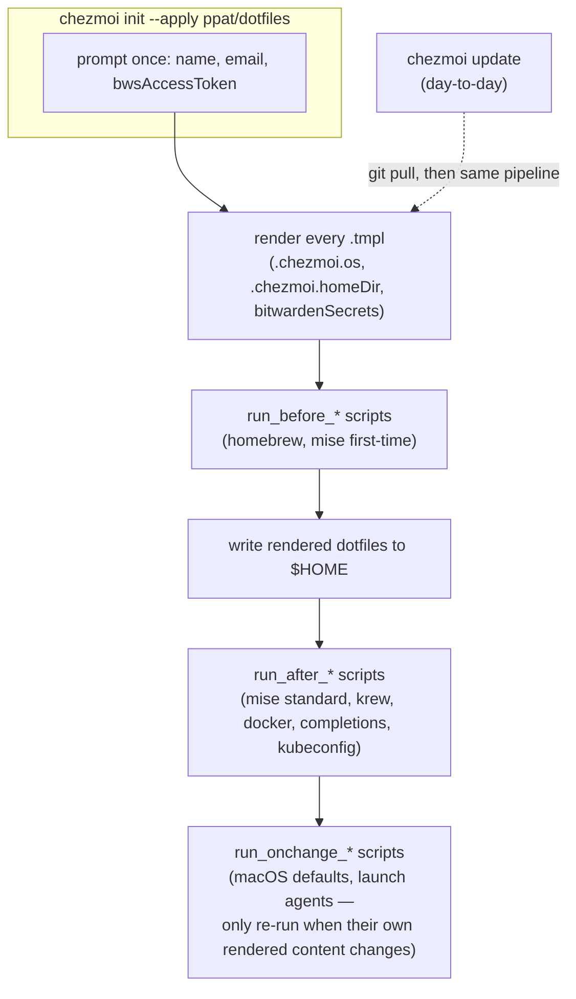
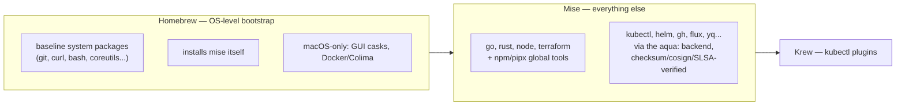
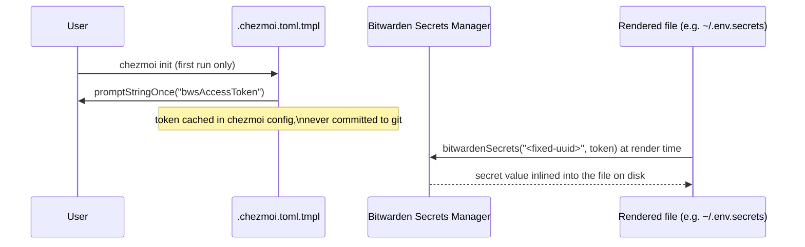

# DESIGN.md

Intent, trade-offs, and system structure behind this dotfiles repo. For "what do I run" / "how are files named",
see [CLAUDE.md](CLAUDE.md); for "how do I know a change is safe", see [TESTING.md](TESTING.md).

## Problem being solved

Personal environment configuration across multiple machines (a macOS laptop, Linux dev boxes, homelab nodes) that
must be:

- reproducible from zero on a fresh machine,
- safe to re-run repeatedly without re-prompting or clobbering machine-specific state,
- free of plaintext secrets in git history,
- cheap to keep current — dependency bumps shouldn't be hand-maintained toil.

## System overview

```mermaid
flowchart TD
    subgraph Bootstrap["chezmoi init --apply ppat/dotfiles"]
        Prompt["prompt once: name, email, bwsAccessToken"]
    end
    Prompt --> Render["render every .tmpl\n(.chezmoi.os, .chezmoi.homeDir, bitwardenSecrets)"]
    Render --> Before["run_before_* scripts\n(homebrew, mise first-time)"]
    Before --> Write["write rendered dotfiles to $HOME"]
    Write --> After["run_after_* scripts\n(mise standard, krew, docker, completions, kubeconfig)"]
    After --> OnChange["run_onchange_* scripts\n(macOS defaults, launch agents —\nonly re-run when their own rendered content changes)"]

    Update["chezmoi update\n(day-to-day)"] -.->|git pull, then same pipeline| Render
```

Chezmoi is the only orchestrator. It isn't a script that happens to call package managers — it *is* the thing
that decides what runs, in what order, against what rendered template context. Everything downstream (Homebrew,
Mise, Krew) is invoked *by* chezmoi scripts, never the reverse.

## Why two package managers, not one

```mermaid
flowchart LR
    subgraph Homebrew["Homebrew — OS-level bootstrap"]
        H1["baseline system packages\n(git, curl, bash, coreutils...)"]
        H2["installs mise itself"]
        H3["macOS-only: GUI casks, Docker/Colima"]
    end
    subgraph Mise["Mise — everything else"]
        M1["go, rust, node, terraform\n+ npm/pipx global tools"]
        M2["kubectl, helm, gh, flux, yq...\nvia the aqua: backend,\nchecksum/cosign/SLSA-verified"]
    end
    Homebrew --> Mise
    Mise --> Krew["Krew — kubectl plugins"]
```

Each tool is used for what it's actually best at, not for uniformity:

- **Homebrew** is the only one of the two that can install itself on a bare OS and that ships macOS GUI apps
  (casks) — so it's the bootstrap layer, and it stays responsible for anything Mise can't do (GUI apps,
  Colima/Docker on macOS, baseline OS packages like `coreutils`/`gnupg`).
- **Mise** owns everything else: language runtimes and per-project version switching (`go`, `rust`, `node`,
  `terraform`), npm/pipx-distributed tools (Claude Code, markdownlint-cli2, ansible-core), and pinned CLI
  binaries (`kubectl`, `helm`, `gh`, cloud CLIs) via its `aqua:` backend. That backend independently verifies
  cosign signatures, SLSA provenance, and GitHub artifact attestations by default, and every install is
  checksum-pinned per platform in a checked-in `mise.lock` (`[settings] lockfile = true` in
  `private_dot_config/mise/config.toml`) — the same per-artifact supply-chain guarantee a separate Aqua
  installation used to provide, now covered by one tool instead of two. Mise's `[[env]]` file-loading in
  `private_dot_config/mise/config.toml` is also how this repo gets environment variables into every shell — no
  chezmoi script is needed for that.

Historical note: this repo used to run Aqua alongside Mise specifically because Mise's `aqua` backend couldn't
maintain a lockfile at the time, so it couldn't give the same checksum guarantee Aqua's own
`checksum.require_checksum` did. Mise's lockfile support closed that gap, so the two-package-manager split
above reflects the current (not original) architecture — see git history for the migration.

## Mise tasks and `conf.d` overlays (PoC #747)

Phase 1 of the mise-bootstrap migration (ticket #747) converted a narrow, reversible slice of this repo's
chezmoi scripts to mise's `conf.d` overlays and file tasks, specifically to bank conventions before later
phases build on them at scale. Full reasoning and falsification steps: ticket #747 and `poc/README.md` (the
`poc/` tree itself never deploys — see that file). This section records the conventions that came out of it.

**`conf.d` overlay layout.** `private_dot_config/mise/conf.d/{linux,darwin}.toml` hold per-OS `[tools]`/
`[bootstrap.packages]` entries; the ~50 common entries stay in `private_dot_config/mise/config.toml` itself.
`.chezmoiignore` excludes whichever overlay doesn't match `.chezmoi.os`, using `ne` (exclude) rather than `eq`
(keep) so an untargeted OS drops both overlays instead of guessing. This isn't cosmetic: a wrong-OS overlay is a
hard `mise` error on this mise version (e.g. `brew-cask:` entries fail outright on Linux;
`mise bootstrap plan --detailed-exitcode` returns 1 instead of 0/2), not a harmless no-op.

**Task layout.** File tasks live under `private_dot_config/mise/tasks/dotfiles/`, one `executable_<name>.tmpl`
per task, namespaced `dotfiles:*` so they're discoverable via `mise tasks ls -g` and can't collide with
per-project tasks elsewhere. Nesting a subdirectory produces a colon-separated group (e.g.
`tasks/dotfiles/darwin/executable_placeholder.tmpl` → `dotfiles:darwin:placeholder`); CI's task linting covers
nested files on both the PR-diff path (`private_dot_config/mise/tasks/**/*.tmpl` glob) and the schedule path
(`find -path './private_dot_config/mise/tasks/*.tmpl'`, whose `*` matches across `/`).

`.chezmoiignore` governs task *files* exactly as it already governs `conf.d` *config* files: a darwin-only task
group (`tasks/dotfiles/darwin/`) is excluded on Linux the same way `conf.d/darwin.toml` is, verified by
diffing `chezmoi managed` output between the real host (`.chezmoi.os` == `linux`: the darwin task group and
`conf.d/darwin.toml` both absent) and a copy with `.chezmoi.os` forced to `darwin` (both present, and
`conf.d/linux.toml` absent instead). This is a second, independent mechanism from the one the pre-existing
darwin-only *scripts* (`run_after_30_docker.sh.tmpl`, `run_after_31_macos_gui_apps.sh.tmpl`) use — those wrap
their entire body in an in-template `{{ if eq .chezmoi.os "darwin" }}`, rendering an empty file on other OSes
rather than being excluded outright. Both work; `.chezmoiignore` is the one that generalises to a whole
directory of future task files without repeating the conditional in each, which is why phase 5's real
darwin-only tasks (docker cli-plugin symlinks, macOS defaults) should follow the task-group form.

**The absolute-path rule, and what it actually gates.** The symptom is "`sources=`/`outputs=` need absolute
paths" — mise does not expand `~` in either field: a tilde path re-runs on every apply with a silent warning
instead of caching, while `{{ .chezmoi.homeDir }}`-rendered absolute paths cache correctly (`sources up-to-date,
skipping`). But the mechanism-level rule underneath that symptom is narrower and matters more:
**`sources=`/`outputs=` may only be used where the task's outputs are the complete, exclusive product of the
task itself.** `dotfiles:completions` satisfies this — it owns all seven completion files it writes, so "have
the sources changed since the outputs were last written" is a sound staleness question. `dotfiles:krew` does
not: its "outputs" are krew's own receipt files, state also written and deleted by `kubectl krew` itself
outside this task's control. Declaring `outputs=["$KREW_ROOT/receipts/*.yaml"]` there made the cache *lie* —
delete one receipt out-of-band and the task reports "up-to-date, skipping" forever; fail mid-install and the
partial receipt set is cached as a permanent false success. `sources` alone (no `outputs`) avoids the lie but
also gives up the only reason to prefer a task there. Verdict: `dotfiles:krew` stays a chezmoi script (see
`poc/README.md`); this is a property of what the task reconciles against, not of tilde-vs-absolute paths, and
it doesn't go away with more careful glob-writing.

**The data-file convention.** A task cannot read `{{ .chezmoi.sourceDir }}` at run time the way a chezmoi
script can — the source tree isn't guaranteed to exist or be current on the target machine once tasks run
outside a `chezmoi apply`. So any data file a task needs to iterate (krew's plugin list today; the Brewfiles in
a later phase) must be a *deployed* file, referenced by a render-time-baked absolute path
(`{{ .chezmoi.homeDir }}/...`), not a source-tree path resolved at run time. This is also why
`krew-plugins.txt` moved from `~/.config/mise/data/` (coupled to mise's own directory conventions, and
meaningless now that `dotfiles:krew` isn't a mise task) to `~/.local/share/dotfiles/` — this repo's own data,
depending on nothing else's layout. Phase 4 should put the Brewfiles in the same place for the same reason.

**Secrets channel: `#MISE env=`, never `#USAGE`.** Config-level `redactions` (in
`private_dot_config/mise/config.toml`) only masks values that reach a task through a `#MISE env={NAME="..."}`
directive. It does **not** mask a `#USAGE`-flag-derived `usage_*` value, default or CLI-supplied, on mise
2026.8.3 — confirmed with a positive and a negative control in the same rig (see
`private_dot_config/mise/tasks/dotfiles/executable_completions.tmpl`'s own comment for the exact commands).
Root cause: `redactions` resolves names against the env map built *before* `#USAGE` values are merged in, so
naming a `usage_*` var in `redactions` never actually looks it up. There is no alternate `#USAGE` sensitivity
flag or per-task syntax that covers this on the current version. Two corollaries worth keeping in mind before
phase 5 wires real `bitwardenSecrets` values into tasks: matching is exact-case-sensitive (a `redactions` entry
that doesn't case-match its `env=` var name silently fails to mask, indistinguishable at a glance from naming
the wrong channel), and mise's own debug log is not a safe fallback check — task stdout is never mirrored into
it either way (so "0 occurrences in the log" proves nothing about stdout), and when file-level debug logging
*is* genuinely enabled (`MISE_LOG_LEVEL=debug`, not just `MISE_LOG_FILE_LEVEL=debug`, which alone is a silent
no-op), a CLI-supplied value leaks into that log **twice** — via the `DEBUG ARGS:` line and the unredacted
command-echo line — regardless of which channel carried it in. Net rule: `#USAGE` stays for ordinary,
non-secret parameters (`--output-dir` on `dotfiles:completions` is the standing example); anything secret goes
through `#MISE env=`.

**`run_onchange_` + task interaction: confirmed silent failure, not adopted.** chezmoi's `run_onchange_`
mechanism hashes the *rendered wrapper script*, not anything it calls. A thin wrapper whose only job is
`mise run dotfiles:something` has rendered bytes that never change, so editing only the task's body leaves the
wrapper's hash untouched and chezmoi never re-runs it — exit 0, nothing logged, the work silently never
happens. This was reproduced with a positive control (a scratch probe: bump the task body only, confirm the
wrapper's onchange script does not re-run; bump the wrapper, confirm it does) rather than assumed. A fix
candidate — embedding a hash of the task's rendered content into the wrapper via chezmoi's `include | sha256sum`
so the wrapper's own bytes change whenever the task does — was built and verified to work on the same probe.
**It was not adopted.** The decision instead is to keep onchange-driven logic (macOS defaults, launch agents)
inline in the wrapper script body, not delegated to a mise task at all: the hash-embed fix works, but it's a
second, easy-to-forget coupling between a script and a task file that only exists to route around a mechanism
mismatch, for logic that doesn't gain anything from being a task in the first place (it isn't reused, doesn't
need `sources=`/`outputs=` caching, and doesn't benefit from `tools=` resolution any more than the krew script
does). Phase 5 should treat this as settled rather than re-deriving it.

**`dotfiles:setup`, the fan-in, and its actual limits.** `dotfiles:setup` `depends` on `dotfiles:completions`
and has no body of its own, proving two things: `depends` can stand in for the numeric `run_after_NN` filename
ordering chezmoi scripts use today, and a cached (skipped-as-up-to-date) dependency doesn't break the
aggregate run (`dotfiles:setup` still exits 0 on a re-run while `dotfiles:completions` reports
"sources up-to-date, skipping" — verified in a scratch rig). What it does **not** prove, because it currently
has exactly one member: ordering or conflict resolution between multiple dependencies, behavior when one
dependency in the set fails outright, or fan-out width. Treat those as open until phase 5 gives this task a
second real dependency.

**`dotfiles:packages` was deliberately not built.** The ticket's §C5 vehicle wanted a task that would (a)
provoke the `run_onchange_`/task question above and (b) apply bootstrap packages. Both are now satisfied
elsewhere: (a) by the dedicated onchange probe referenced above, and (b) by `apply_bootstrap_packages` in
`.chezmoitemplates/script_mise.sh`, already called from `run_after_20_mise-standard.sh.tmpl` on every apply.
Building `dotfiles:packages` now would ship a `run_onchange_`-triggered task purely to have a third
`dotfiles:setup` dependency, which is exactly the mechanism this section just said not to use. Its omission is
a resourced decision, not an unfinished corner: `mise tasks ls -g` lists `dotfiles:{completions,setup}` and the
excluded `dotfiles:darwin:placeholder`, not `dotfiles:{packages,completions,krew,setup}` as the ticket's
original criterion 8 assumed.

## First-time vs. standard setup

Chezmoi scripts split into `run_before_NN_*` (before dotfiles are written) and `run_after_NN_*` (after). Within
that, the Mise scripts fork into a `First-Time` path and a `Standard` path (see
`.chezmoitemplates/script_mise.sh`):

- **First-time**: destructive — wipes and reinitializes the tool's global config directory from
  `.first-time-setup/`, then does a fresh install. Runs once, guarded by a sentinel file
  (`.first-time-setup-complete`) so it never repeats.
- **Standard**: idempotent maintenance — upgrades installed packages, then prunes/vacuums anything unused. Safe
  to run on every `chezmoi update`.

This split exists because a fresh machine and a years-old machine need different things: a fresh machine needs
its config directory seeded from a known-good state, not whatever partial state a previous half-run left behind,
while an established machine must never have its config directory wiped just because `chezmoi update` ran again.

## Secrets: Bitwarden Secrets Manager, not plaintext

```mermaid
sequenceDiagram
    participant User
    participant ChezmoiToml as .chezmoi.toml.tmpl
    participant BWS as Bitwarden Secrets Manager
    participant Rendered as Rendered file (e.g. ~/.env.secrets)

    User->>ChezmoiToml: chezmoi init (first run only)
    ChezmoiToml->>User: promptStringOnce("bwsAccessToken")
    Note over ChezmoiToml: token cached in chezmoi config,\nnever committed to git
    Rendered->>BWS: bitwardenSecrets("<fixed-uuid>", token) at render time
    BWS-->>Rendered: secret value inlined into the file on disk
```

Every credential (Anthropic/OpenRouter API keys, cloud creds, Terraform variables, Kubernetes OIDC client
secrets) is fetched by a fixed secret UUID through the `bitwardenSecrets` template function, resolved only at
`chezmoi apply` time on the target machine. The repo therefore contains *which* secrets exist and their UUIDs,
but never a value. That trade-off is deliberate: a leaked UUID list is far less damaging than a leaked value, and
the UUIDs are useless without a valid `bwsAccessToken`.

It's also why environment config is split across two files instead of one: `private_dot_env.tmpl` holds config
that's fine to always load (colors, XDG paths, package-manager env), while `private_dot_env.secrets.tmpl` is
loaded only opportunistically (its `[[env]]` entry is commented out by default in
`private_dot_config/mise/config.toml`) so secrets aren't pulled into every shell session unless actually needed.

## CI can't be the full story

The lint pipeline (see [TESTING.md](TESTING.md)) renders every template with `.chezmoi.os` forced to `"linux"`
and every `bitwardenSecrets` call blanked out before linting. That's a deliberate, narrow goal: catch template
syntax errors and lint the *shape* of rendered output, not validate macOS-only code paths or real secret
substitution. Those two things can only be proven by `chezmoi apply` on a real machine with a real
`bwsAccessToken`, which is inherently outside what a shared CI runner can do. CI is a syntax/lint safety net, not
an end-to-end guarantee.

## Shared CI logic lives in a sibling repo

`.github/workflows/lint.yaml` delegates most of its jobs (Markdown, YAML, shellcheck, GitHub Actions, Renovate
config, pre-commit) to reusable workflows in `ppat/github-workflows`, pinned by commit SHA. Only the
chezmoi-specific rendering step is inlined, because it's the one piece of logic unique to how *this* repo's
templates work. Everything generic is shared and versioned once across this user's repos, and Renovate keeps the
pinned SHA current — the same automation-over-manual-toil principle applied to CI as to package versions.

## Renovate: one custom manager for template-pinned versions

Mise tracks its own tool versions natively (`mise/config.toml`), so Renovate's built-in `mise` manager handles
version bumps directly — including the `aqua:owner/repo`-backed entries — and also understands `mise.lock`
directly: it extracts each dependency's `lockedVersion` from the lockfile, and `lockFileMaintenance` (already
enabled repo-wide by the `ppat/renovate-presets:dev-tools` preset this repo extends — no extra config needed
here) periodically runs `mise lock --bump` to refresh it. That lockfile refresh is gated behind Renovate's
"unsafe execution" trust model, though, since running `mise lock` can execute repository-defined behavior: it
only actually runs once `mise` is added to the `allowedUnsafeExecutions` setting. That's a *self-hosted global*
Renovate setting (`RENOVATE_ALLOWED_UNSAFE_EXECUTIONS` env var / `--allowed-unsafe-executions` CLI flag /
admin config file — never something a repo's own `renovate.json` can set), and this org's Renovate runs
self-hosted via GitHub Actions (`ppat/github-workflows`'s `renovate.yaml`, which drives
`renovatebot/github-action` through env vars) — so the fix lives there
(`RENOVATE_ALLOWED_UNSAFE_EXECUTIONS: '["mise"]'` in that workflow's `env:` block), not in this repo. Tool
versions embedded as plain strings inside YAML/`.env` files (e.g. `CHEZMOI_VERSION` in `lint.yaml`) aren't a
format Renovate understands out of the box. The custom regex manager in `.github/renovate.json` closes that
narrow gap by keying off a `# renovate: datasource=... depName=...` comment convention — one mechanism, used
only where the native managers don't reach.
