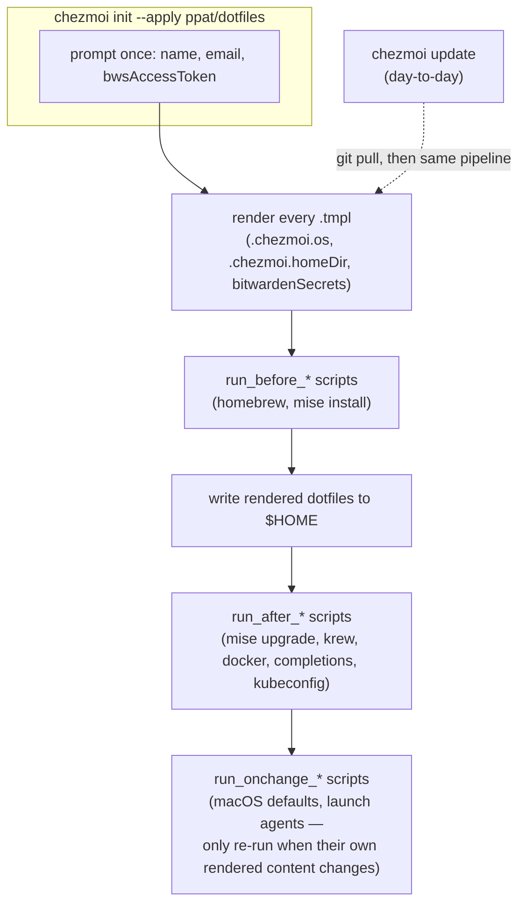
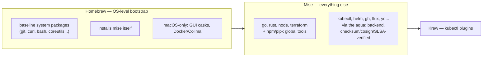
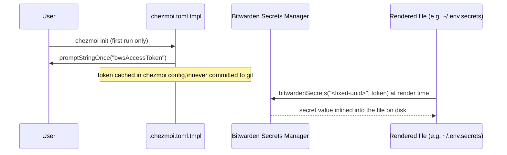

# DESIGN.md

Intent, trade-offs, and system structure behind this dotfiles repo. For "what do I run" / "how are files named",
see [CLAUDE.md](CLAUDE.md); for "how do I know a change is safe", see [TESTING.md](TESTING.md).

## Problem being solved

Personal environment configuration across multiple machines (a macOS laptop, Linux dev boxes, homelab nodes) that
must be:

- reproducible from zero on a fresh machine,
- safe to re-run repeatedly without re-prompting or clobbering machine-specific state,
- free of plaintext secrets in git history,
- cheap to keep current — dependency bumps shouldn't be hand-maintained toil.

## System overview

```mermaid
flowchart TD
    subgraph Bootstrap["chezmoi init --apply ppat/dotfiles"]
        Prompt["prompt once: name, email, bwsAccessToken"]
    end
    Prompt --> Render["render every .tmpl\n(.chezmoi.os, .chezmoi.homeDir, bitwardenSecrets)"]
    Render --> Before["run_before_* scripts\n(homebrew, mise install)"]
    Before --> Write["write rendered dotfiles to $HOME"]
    Write --> After["run_after_* scripts\n(mise upgrade, krew, docker, completions, kubeconfig)"]
    After --> OnChange["run_onchange_* scripts\n(macOS defaults, launch agents —\nonly re-run when their own rendered content changes)"]

    Update["chezmoi update\n(day-to-day)"] -.->|git pull, then same pipeline| Render
```

Chezmoi is the only orchestrator. It isn't a script that happens to call package managers — it *is* the thing
that decides what runs, in what order, against what rendered template context. Everything downstream (Homebrew,
Mise, Krew) is invoked *by* chezmoi scripts, never the reverse.

## Why two package managers, not one

```mermaid
flowchart LR
    subgraph Homebrew["Homebrew — OS-level bootstrap"]
        H1["baseline system packages\n(git, curl, bash, coreutils...)"]
        H2["installs mise itself"]
        H3["macOS-only: GUI casks, Docker/Colima"]
    end
    subgraph Mise["Mise — everything else"]
        M1["go, rust, node, terraform\n+ npm/pipx global tools"]
        M2["kubectl, helm, gh, flux, yq...\nvia the aqua: backend,\nchecksum/cosign/SLSA-verified"]
    end
    Homebrew --> Mise
    Mise --> Krew["Krew — kubectl plugins"]
```

Each tool is used for what it's actually best at, not for uniformity:

- **Homebrew** is the only one of the two that can install itself on a bare OS and that ships macOS GUI apps
  (casks) — so it's the bootstrap layer, and it stays responsible for anything Mise can't do (GUI apps,
  Colima/Docker on macOS, baseline OS packages like `coreutils`/`gnupg`).
- **Mise** owns everything else: language runtimes and per-project version switching (`go`, `rust`, `node`,
  `terraform`), npm/pipx-distributed tools (Claude Code, markdownlint-cli2, ansible-core), and pinned CLI
  binaries (`kubectl`, `helm`, `gh`, cloud CLIs) via its `aqua:` backend. That backend independently verifies
  cosign signatures, SLSA provenance, and GitHub artifact attestations by default, and every install is
  checksum-pinned per platform in a checked-in `mise.lock` (`[settings] lockfile = true` in
  `private_dot_config/mise/config.toml`) — the same per-artifact supply-chain guarantee a separate Aqua
  installation used to provide, now covered by one tool instead of two. Mise's `[[env]]` file-loading in
  `private_dot_config/mise/config.toml` is also how this repo gets environment variables into every shell — no
  chezmoi script is needed for that.

Historical note: this repo used to run Aqua alongside Mise specifically because Mise's `aqua` backend couldn't
maintain a lockfile at the time, so it couldn't give the same checksum guarantee Aqua's own
`checksum.require_checksum` did. Mise's lockfile support closed that gap, so the two-package-manager split
above reflects the current (not original) architecture — see git history for the migration.

## Mise setup: install before the render, maintain after

Chezmoi scripts split into `run_before_NN_*` (before the rendered dotfiles are written to `$HOME`) and
`run_after_NN_*` (after). Mise appears on both sides of that line for exactly one reason: **`bws` has to exist
before any template calling `bitwardenSecrets` is rendered**, and rendering happens in the write phase, after
`run_before_*` has run.

- **`run_before_20_mise-install`** — one `mise install` against the repo's single `config.toml`, then copies the
  resulting `bws` binary into `~/.local/bin` so the render phase (and every later script) can call it without
  mise activation. `~/.config/mise/config.toml` hasn't been written yet at this point, so mise is pointed at the
  source-of-truth config via `MISE_GLOBAL_CONFIG_FILE` — specifically at a throwaway *copy* of it, because mise
  rewrites `mise.lock` next to whichever config file it is handed, and the chezmoi source directory is a git
  clone that `chezmoi update` pulls into. A lockfile dirtied there would break the next pull.
- **`run_after_20_mise-upgrade`** — idempotent maintenance against the now-deployed
  `~/.config/mise/config.toml`: refresh `mise.lock` from source (picking up Renovate-driven checksum bumps),
  `mise upgrade`, then prune anything no longer declared. Safe on every `chezmoi update`.

That same "mise owns the lockfile" property is why `mise.lock` is `.chezmoiignore`d and copied explicitly by the
script instead of being deployed as a chezmoi target. mise rewrites the deployed `~/.config/mise/mise.lock`
whenever it has to lock something that file doesn't already cover — not on every run (with the lockfile in sync,
`mise upgrade`/`mise prune` leave it byte-identical), but on any run where `config.toml` is ahead of it. Measured
with the file managed rather than ignored: one `chezmoi apply --force` left it modified, and the next
non-interactive apply hard-failed on "has changed since chezmoi last wrote it" with no TTY to answer on. It looks
like untidiness; it is load-bearing.

There is deliberately **no** first-run special case — no seed config, no sentinel file, no wiping of the mise
config directory. An earlier design staged fresh machines in two passes on the assumption that `npm:`/`pipx:`/
`cargo:` entries need `node`/`bun`/`uv`/`cargo-binstall` installed by an earlier pass. That premise is false:
mise sequences its own backends. Measured on a container with mise 2026.8.3 and no ambient
`node`/`bun`/`uv`/`python3`/`cargo`, a single `mise install` against this repo's config installed all 49 tools
in ~27s, exit 0, with `mise ls --missing` empty afterwards. Nothing needs sequencing, so nothing needs a second
pass — and the destructive re-initialization of the config directory that the "a fresh machine needs a
known-good starting state" story justified goes away with it.

## Secrets: Bitwarden Secrets Manager, not plaintext

```mermaid
sequenceDiagram
    participant User
    participant ChezmoiToml as .chezmoi.toml.tmpl
    participant BWS as Bitwarden Secrets Manager
    participant Rendered as Rendered file (e.g. ~/.env.secrets)

    User->>ChezmoiToml: chezmoi init (first run only)
    ChezmoiToml->>User: promptStringOnce("bwsAccessToken")
    Note over ChezmoiToml: token cached in chezmoi config,\nnever committed to git
    Rendered->>BWS: bitwardenSecrets("<fixed-uuid>", token) at render time
    BWS-->>Rendered: secret value inlined into the file on disk
```

Every credential (Anthropic/OpenRouter API keys, cloud creds, Terraform variables, Kubernetes OIDC client
secrets) is fetched by a fixed secret UUID through the `bitwardenSecrets` template function, resolved only at
`chezmoi apply` time on the target machine. The repo therefore contains *which* secrets exist and their UUIDs,
but never a value. That trade-off is deliberate: a leaked UUID list is far less damaging than a leaked value, and
the UUIDs are useless without a valid `bwsAccessToken`.

It's also why environment config is split across two files instead of one: `private_dot_env.tmpl` holds config
that's fine to always load (colors, XDG paths, package-manager env), while `private_dot_env.secrets.tmpl` is
loaded only opportunistically (its `[[env]]` entry is commented out by default in
`private_dot_config/mise/config.toml`) so secrets aren't pulled into every shell session unless actually needed.

## Codex: managed defaults, local trust state

Codex is installed by Mise alongside Claude Code, but its `config.toml` contains two independently changing
concerns. Chezmoi renders the desired defaults and LiteLLM-backed MCP definitions from
[`private_dot_codex/private_dot_managed.toml.tmpl`](private_dot_codex/private_dot_managed.toml.tmpl) to
`~/.codex/.managed.toml`; [`run_after_63_codex-config`](.chezmoiscripts/run_after_63_codex-config.sh.tmpl)
merges those values into the effective `~/.codex/config.toml` on every apply.

The merge owns the managed defaults and the complete `mcp_servers` table, so an apply converges integrations and
removes retired MCP definitions. It deliberately retains Codex-owned entries, including per-project trust under
`[projects.*]` and global-hook review hashes under `[hooks.state.*]`. Those entries record machine-local security
decisions and would be incorrectly reset by a declarative file replacement. Global hooks are therefore reviewed
once per user/machine and again only when their definitions in
[`private_dot_codex/hooks.json`](private_dot_codex/hooks.json) change. Codex's PreToolUse adapter reuses
the Claude guard implementations, suppressing their successful `allow` response because Codex accepts denials but
does not support that success decision.

The managed fragment carries Codex's `code` permissions profile but does not activate it. During every apply,
the reconciliation script selects one complete effective mode: macOS retains its established `code` profile; on
Linux, `codex sandbox -- /usr/bin/true` tests whether Codex can start its sandbox. A supported sandbox activates
`default_permissions = "code"`; an unsupported sandbox removes that profile and sets
`sandbox_mode = "danger-full-access"`. This converges in both directions, so a Linux machine cannot retain an
outdated mode after its sandbox capability changes. Full access is appropriate only where the environment supplies
the intended outer isolation boundary; auto-review remains a request-review mechanism, not a filesystem boundary.

## CI can't be the full story

The lint pipeline (see [TESTING.md](TESTING.md)) renders every template with `.chezmoi.os` forced to `"linux"`
and every `bitwardenSecrets` call blanked out before linting. That's a deliberate, narrow goal: catch template
syntax errors and lint the *shape* of rendered output, not validate macOS-only code paths or real secret
substitution. Those two things can only be proven by `chezmoi apply` on a real machine with a real
`bwsAccessToken`, which is inherently outside what a shared CI runner can do. CI is a syntax/lint safety net, not
an end-to-end guarantee.

## Shared CI logic lives in a sibling repo

`.github/workflows/lint.yaml` delegates most of its jobs (Markdown, YAML, shellcheck, GitHub Actions, Renovate
config, pre-commit) to reusable workflows in `ppat/github-workflows`, pinned by commit SHA. Only the
chezmoi-specific rendering step is inlined, because it's the one piece of logic unique to how *this* repo's
templates work. Everything generic is shared and versioned once across this user's repos, and Renovate keeps the
pinned SHA current — the same automation-over-manual-toil principle applied to CI as to package versions.

## Renovate: one custom manager for template-pinned versions

Mise tracks its own tool versions natively (`mise/config.toml`), so Renovate's built-in `mise` manager handles
version bumps directly — including the `aqua:owner/repo`-backed entries — and also understands `mise.lock`
directly: it extracts each dependency's `lockedVersion` from the lockfile, and `lockFileMaintenance` (already
enabled repo-wide by the `ppat/renovate-presets:dev-tools` preset this repo extends — no extra config needed
here) periodically runs `mise lock --bump` to refresh it. That lockfile refresh is gated behind Renovate's
"unsafe execution" trust model, though, since running `mise lock` can execute repository-defined behavior: it
only actually runs once `mise` is added to the `allowedUnsafeExecutions` setting. That's a *self-hosted global*
Renovate setting (`RENOVATE_ALLOWED_UNSAFE_EXECUTIONS` env var / `--allowed-unsafe-executions` CLI flag /
admin config file — never something a repo's own `renovate.json` can set), and this org's Renovate runs
self-hosted via GitHub Actions (`ppat/github-workflows`'s `renovate.yaml`, which drives
`renovatebot/github-action` through env vars) — so the fix lives there
(`RENOVATE_ALLOWED_UNSAFE_EXECUTIONS: '["mise"]'` in that workflow's `env:` block), not in this repo. Tool
versions embedded as plain strings inside YAML/`.env` files (e.g. `CHEZMOI_VERSION` in `lint.yaml`) aren't a
format Renovate understands out of the box. The custom regex manager in `.github/renovate.json` closes that
narrow gap by keying off a `# renovate: datasource=... depName=...` comment convention — one mechanism, used
only where the native managers don't reach.
