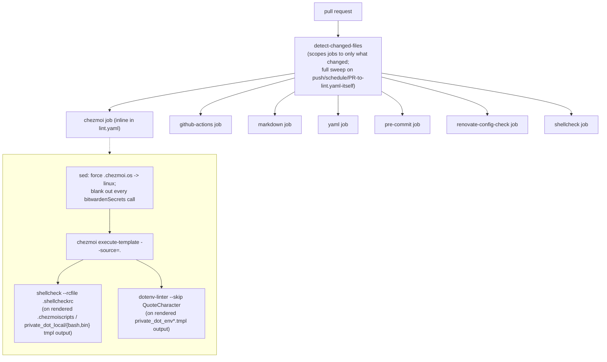

# TESTING.md

There is no unit-test suite — this repo is configuration, not application logic. Confidence in a change comes
from a **render-then-lint** workflow: every templated file is rendered to what it would actually look like on
disk, then the rendered output is checked with format-appropriate tools. Static analysis/linting *commands* are
listed in [CLAUDE.md](CLAUDE.md); this doc describes the actual mechanism — what runs, in what order, against
what, and what it does and doesn't prove. Design rationale is in [DESIGN.md](DESIGN.md).

## The mechanism, end to end



Each job below is delegated to a reusable workflow in the sibling `ppat/github-workflows` repo, pinned by commit
SHA — this repo supplies only the file list and its own lint configs (`.shellcheckrc`, `.yamllint`,
`.markdownlint-cli2.yaml`, `.pre-commit-config.yaml`).

### 1. Change detection scopes the run

A `detect-changed-files` job classifies changed files into buckets (`chezmoiscripts`, `chezmoienv`, `actions`,
`markdown`, `renovate`, `shellscripts`, `yaml`). On a pull request, each downstream job only runs if its bucket
has changes, and only lints the changed files in that bucket. On push to `main`, on the weekly schedule
(`0 5 * * 1`), or on manual dispatch, every job runs against the full repo (`ALL`). This means a PR that only
touches, say, `krew-plugins.txt` triggers no lint jobs at all — nothing in that bucket maps to a checked file
type.

### 2. Chezmoi templates: render first, then lint the output — never the template source

This is the one job inlined directly in `.github/workflows/lint.yaml` rather than delegated, because it's the
only lint step that understands this repo's template syntax.

- Every `.tmpl` file has `"darwin"` string-replaced with `"linux"` and every
  `{{ (bitwardenSecrets "...".value }}` call replaced with the literal string `fake-test-value`, via `sed`,
  *before* rendering.
- `chezmoi execute-template --source=$(pwd)` renders the patched template to what chezmoi would actually write to
  disk.
- The rendered `.chezmoiscripts/*` and `private_dot_local/{bash,bin}/*` shell scripts are shellchecked with this
  repo's `.shellcheckrc`.
- The rendered `private_dot_env*` files are checked with `dotenv-linter --skip QuoteCharacter`.

What this proves: the template renders without error, and the *shape* of what it produces is valid shell /
valid dotenv syntax. What it does not prove: that the script behaves correctly with real secret values, or that
any `{{ if eq .chezmoi.os "darwin" }}` branch works, since that branch is never taken in CI (`.chezmoi.os` is
always forced to `"linux"`). macOS-only logic and real-secret behavior can only be verified by actually running
`chezmoi apply` on a real machine with a real Bitwarden token — there is no substitute for that in this repo's CI.

### 3. Everything else is format-level static checking on rendered/plain files

- **shellcheck job** — every executable file in the repo (or just the changed ones on a PR), via
  `find ... -executable -exec shellcheck --rcfile .shellcheckrc {} +`. This is broader than the chezmoi job's
  shellcheck pass: it catches plain (non-templated) executables like `private_dot_local/bin/executable_show-env`
  too.
- **github-actions job** — `actionlint -shellcheck "shellcheck --rcfile .shellcheckrc"` against
  `.github/workflows/*.yaml`, which also shellchecks any inline `run:` steps.
- **markdown job** — `markdownlint-cli2` against `**/*.md` using `.markdownlint-cli2.yaml` (CHANGELOG.md files
  are excluded when running against a changed-file subset).
- **yaml job** — `yamllint -c .yamllint --strict` against all `.yaml`/`.yml` files.
- **renovate-config-check job** — `renovate-config-validator` against `.github/renovate.json` and every file
  under `.github/renovate/`.
- **pre-commit job** — installs this repo's `.pre-commit-config.yaml` hooks and runs each one individually
  against the whole tree: `check-added-large-files`, `check-executables-have-shebangs`, `check-json`,
  `detect-private-key`, `end-of-file-fixer`, `forbid-new-submodules`, `mixed-line-ending`, `trailing-whitespace`.
  Note this list is narrower than the full hook set defined in `.pre-commit-config.yaml` — the texthooks,
  yamllint, shellcheck, and markdownlint-cli2 hooks in that file are exercised locally via
  `pre-commit run --all-files`, but aren't re-run as individual named CI steps (yamllint/shellcheck/markdownlint
  are already covered above, by the dedicated jobs, using this repo's own config rather than pre-commit's hook
  wrapper).

## What gains confidence locally, before pushing

```bash
# Render a specific template exactly like CI does, to eyeball the output
sed -i 's|"darwin"|"linux"|; s|{{ (bitwardenSecrets ".*" .bwsAccessToken).value }}|fake-test-value|' /tmp/copy-of-file.tmpl
chezmoi execute-template --source=. < /tmp/copy-of-file.tmpl

# Preview what a real chezmoi apply would change on this machine, without writing anything
chezmoi diff --source .

# Run the full local pre-commit hook set (broader than the CI pre-commit job — see above)
pre-commit run --all-files
```

`chezmoi diff --source .` is the closest thing this repo has to an integration test: it renders every template
with this machine's *real* `.chezmoi.toml.tmpl` data (real OS, real secrets if `bwsAccessToken` is configured)
and shows exactly what would change on disk — the one check that exercises real secret substitution and the real
OS branch, which CI structurally cannot do.
